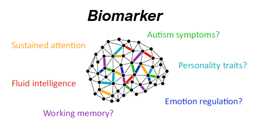

- 연구배경: 주의력결핍 과잉행동장애 (ADHD)와 같은 정신과 질환은 주요한 임상적 특징 이외에도 각 환자마다 보여지는 임상적 증상이 다양하다. 뇌영상기술을 통해 환자들의 증상을 정확하게 진단하는 것과 이에 따른 약을 처방하는 것은 어려운 문제였다. 이로 인해 뇌영상기술과 함께 정상군과 다르게 보여지는 뇌 영역들에 대한 연구도 지속적으로 이루어지고 있으나 개인마다  

- 환자군에서 정상군과 다르게 보여지는 뇌 영역들에 대한 연구는 지속적으로 이루어지고 있으나 환자군 내 각 개인마다 증상의 심각도나 인지적 결손이 다양하여 연구결과들은 비일관적인 경향을 보인다. 이를 해결하기 위해서 증상과 관련된 여러 뇌영역들과 인지적 기능의 관계를 수학적 모델링이나 알고리즘을 이용하여 보여주는 연구들이 발전하고 있다. 본 연구는 ADHD의 주요 증상인 부주의와 충동성 정도를 각 환자들의 기능적 연결성으로 예측하는 모델을 만들기 위해서 수행되었다. 
  
  
  
  

- 방법: 커넥톰 기반 예측 모델링은 뇌 연결망과 행동점수간 관계를 모델로 만들어서 개인의 행동을 예측하는 알고리즘이다. 본 연구에는 299명의 ADHD 아동들과 정상아동들이 참여하였다. 대상자들은 특정한 인지과제를 수행하지 않고 깨어있는 상태를 촬영한 휴지기 fMRI 이미지와 Korean ADHD Rating Scale (K-ARS) 검사를 통해 측정한 부주의 점수와 충동성 점수를 CPM알고리즘에 적용하여 기능적 연결성으로 부주의와 충동성 정도를 예측하는 모델을 만들었다. CPM 알고리즘으로 만들어진 모델을 5-묶음 교차검증법(5-fold cross validation)을 이용하여 검증하였다. 훈련 데이터로 만들어진 모델에 시험 데이터의 기능적 연결성 데이터를 넣었을 때 나오는 값인 예측된 임상점수와 실제 임상점수와의 상관을 계산하였다. 예측된 5 묶음의 시험 데이터의 부주의 점수와 충동성 점수는 는 실제 부주의 점수와 충동성 점수와 유의미한 상관을 보였다.
  
  결론: 본 연구는 CPM을 통해 ADHD의 주요한 증상인 부주의를 교차검증으로 시험 데이터를 예측할 수 있음을 확인하였다. 이를 통해 개인의 휴지기 기능적 연결성이 ADHD의 주요한 임상 증상 중 하나인 부주의와 충동성에 대한 정보를 담고 있음을 시사한다. 
  
  

### *연구배경:

Studies have persistently investigated brain regions in ADHD patients that show abnormalities compared to normal controls. However, due to diverse cognitive dysfunctions and related neural correlates in ADHD, results are non-converging showing lack of reliability. To resolve this problem computational models have been developed incorporating related brain regions and investigating relationships with relevant behaviors or symptoms with increased robustness. Yet, few models predict each subjects’ primary symptoms of ADHD which takes individuality into account.
**Methods**: Using resting state brain scans of 299 children with and without ADHD, we constructed a model by using CPM(Connectome based Predictive Modeling) to predict individual differences in inattentive and hyperactive symptom severity. In addition, we generalized each of these two models to other neuropsychological test batteries to identify shared components. 
**Results**: Using leave-one-subject-out CPM, both inattentive and hyperactive models showed significant predictive power with generalization to novel individuals. We found predictive functional networks of inattentive and hyperactive phenotype that appear in widespread patterns across the whole-brain. Among 4 sets of neuropsychological tests, both inattentive and hyperactive model generalized to ATA-vision and Stroop tests. This indicates that primary symptoms of ADHD that are reflected in selected functional brain features involve cognitive measurements of these two neuropsychological tests. 
**Conclusions**: Functional connections of an individual contain information about two primary symptoms or phenotypes of ADHD and share components with cognitive measures from certain types of neuropsychological test batteries which are ATA-vision and Stroop test.

##### 